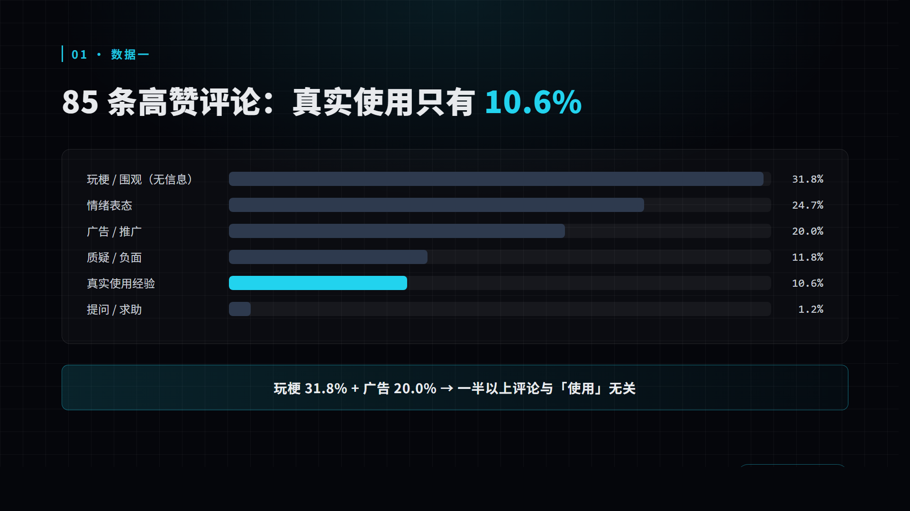
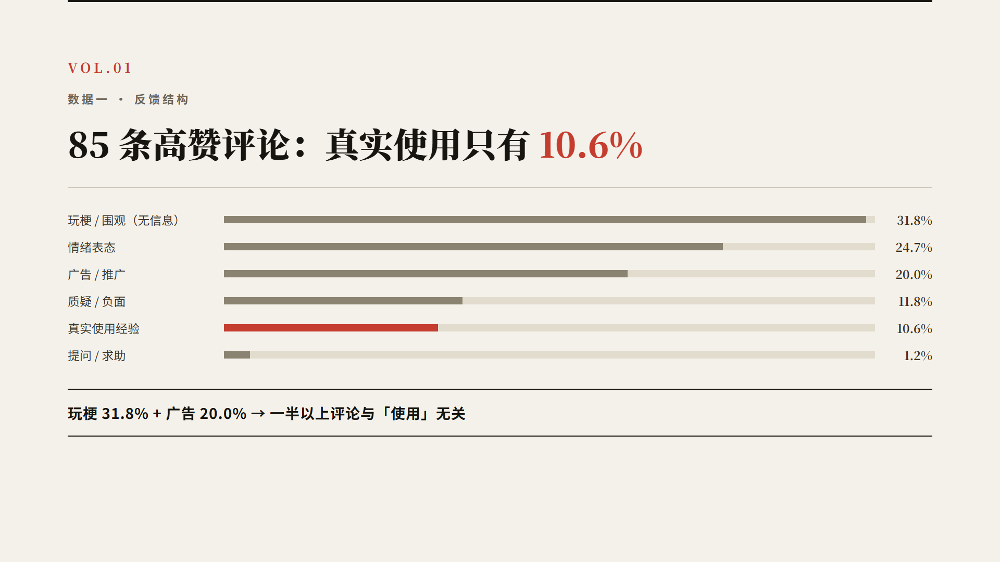
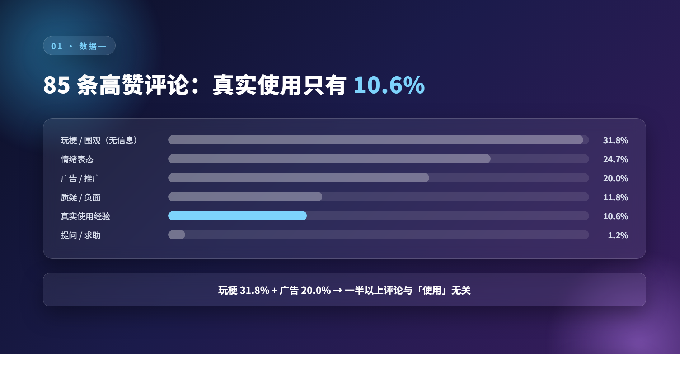
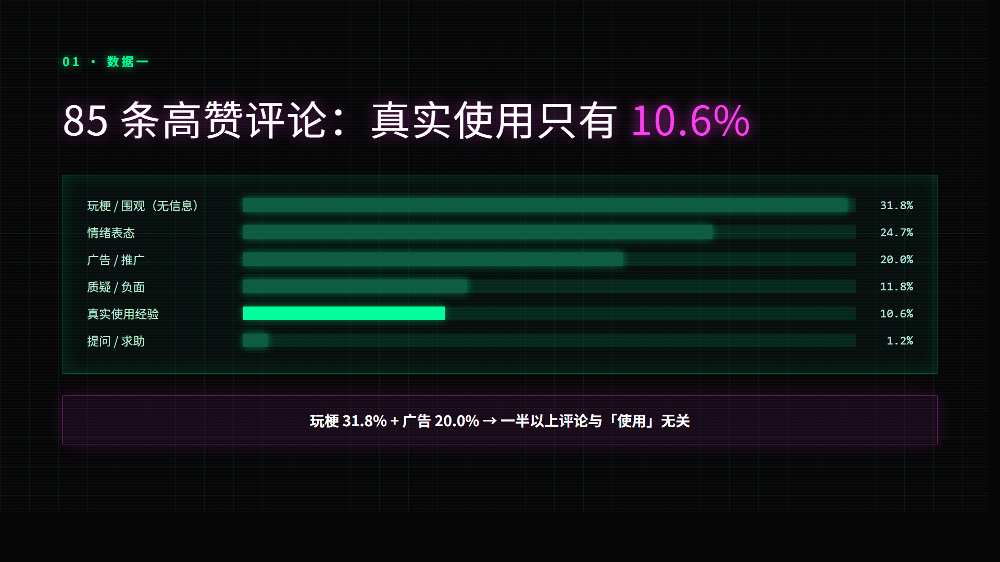
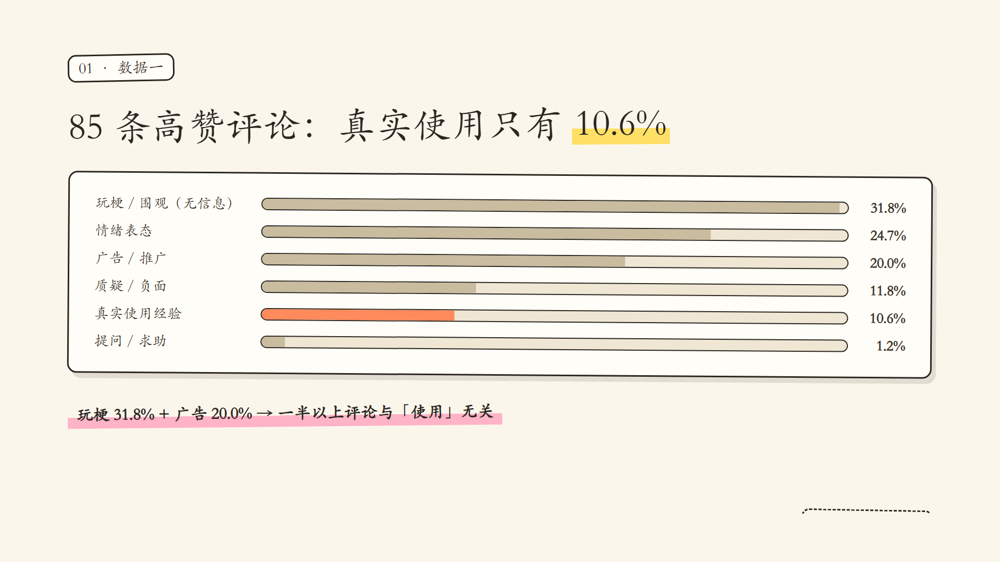
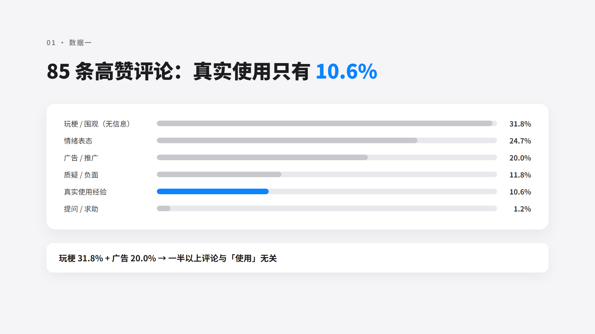

# AI杂谈 · 视频风格样板（6 选 1）

> 说明：以下 6 套风格都用第一期《AI 工作台值不值》的真实内容渲染了同一页样张（1920×1080），
> 方便同内容横向对比。选定后，leeon 会按该风格 **一比一复刻** 整套 PPT 与视频（配色、字体、卡片、图表、动效、音效全部对齐）。
> 样张文件：`风格01-深空数据舱.png` ～ `风格06-苹果极简.png`（本目录）。

---

## 风格 01 · 深空数据舱（推荐）

- 样张：
- **气质**：理性、硬核、克制的高级科技感，和数据人设最配
- **字体**：Noto Sans SC（黑体）+ Consolas 等宽数字
- **色板**：底 `#05060B` ／ 主字 `#E8EAED` ／ 强调青 `#22D3EE` ／ 边框白 10%
- **背景**：近黑 + 48px 细网格（4.5% 透明度）+ 顶部青色径向光
- **卡片**：1px 半透明白边框 + 极低透明度填充，圆角 18px
- **图表**：青色数据柱 + 深色轨道
- **动效**：网格淡入 → 标题上滑 → 数据柱从 0 缓动增长 → 数值滚动 → 关键数字扫光；转场 0.5s 淡入+轻位移
- **音效**：低频「咚」开场 + 数据增长的计数「滴-滴」音
- **风险**：几乎无，最稳

---

## 风格 02 · 编辑杂志

- 样张：
- **气质**：高级、安静、纸媒质感，适合深度观点和长文案
- **字体**：思源宋体 900 标题 + Noto Sans 正文（衬线大字天然高级）
- **色板**：米白底 `#F4F1EA` ／ 墨字 `#16150F` ／ 强调红 `#C53D2E` ／ 分隔线 `#C9C2B2`
- **背景**：米白 + 顶部 4px 黑线 + 细分隔线，大量留白
- **卡片**：不用卡片，用编号（VOL.01）和分隔线建立秩序
- **图表**：14px 细柱 + 衬线数字
- **动效**：标题逐字上滑 → 分隔线从中间展开 → 柱子增长；转场 0.6s 缓入，收尾淡到米白
- **音效**：纸张翻页声 + 低频提示
- **风险**：更像杂志而非科技号，看目标受众是否吃这套

---

## 风格 03 · 玻璃拟态

- 样张：
- **气质**：通透、现代、有呼吸感
- **字体**：Noto Sans SC
- **色板**：深蓝紫渐变底 `#0B1026 → #3A1C5E` ／ 白字 ／ 天蓝 `#7DD3FC` + 紫 `#C084FC`
- **背景**：蓝紫双色模糊光晕 + 半透明玻璃卡片（backdrop blur）
- **图表**：玻璃轨道 + 天蓝柱
- **动效**：卡片逐个悬浮上浮 → 背景光晕缓慢漂移 → 柱子模糊到清晰地增长；转场用卡片模糊散开/聚合
- **音效**：轻柔「叮」、水声感
- **风险**：blur 渲染成本高，视频编码慢；看久了容易腻；更适合 B 站/小红书

---

## 风格 04 · 霓虹实验室

- 样张：
- **气质**：年轻、赛博、视觉冲击强
- **字体**：站酷庆科黄油体标题 + Noto Sans 正文
- **色板**：黑底 ／ 荧光绿 `#00FF9C` ／ 荧光粉 `#FF3DF0` ／ 白字
- **背景**：黑 + 绿色网格 + 扫描线 + 霓虹光晕
- **图表**：霓虹发光柱 + 发光边框
- **动效**：文字霓虹点亮（先暗后亮+光晕扩散）→ 扫描线扫过 → 柱子荧光充能式增长；转场闪白/光圈收缩
- **音效**：电子合成音「嗡——叮」
- **风险**：最容易翻车成「廉价网吧风」，对配色和动效要求极高，慎选

---

## 风格 05 · 手绘白板

- 样张：
- **气质**：亲和、讲解感、学生感，适合教学和口播
- **字体**：马善政手写体 + 楷体
- **色板**：米纸底 `#FBF6EC` ／ 墨字 `#2B2620` ／ 高亮黄 `#FFE066` ／ 粉 `#FFB3C7` ／ 橙 `#FF8A5C`
- **背景**：米白 + 点状网格纸纹理
- **图表**：手绘风边框柱 + 虚线标签
- **动效**：文字手写描边 → 荧光高亮扫过 → 柱子像「画」出来；转场用翻白板/橡皮擦
- **音效**：马克笔声 + 翻页声
- **风险**：亲和但和「数据硬核」气质有点冲突；作为口播时的注释辅助效果很好

---

## 风格 06 · 苹果极简

- 样张：
- **气质**：克制、干净、高级，留白即高级
- **字体**：Noto Sans SC 800
- **色板**：浅灰底 `#F5F5F7` ／ 黑字 `#1D1D1F` ／ 蓝 `#0A84FF` ／ 白卡片+柔和阴影
- **背景**：纯浅灰 + 大留白
- **图表**：浅灰轨道 + 蓝柱，白卡片 28px 圆角
- **动效**：全元素 0.5s 缓动淡入上移，不做花哨特效；柱子慢速 ease-out 增长；转场直接淡入
- **音效**：只用极轻提示音或不用
- **风险**：高级但「素」，抓眼球弱一些，适合知识密度高的内容

---

## 我的建议

1. **首选风格 01 深空数据舱**：和数据人设最配，制作最稳，不会翻车。
2. **备选风格 02 编辑杂志**：差异化最强，B 站/小红书里少见，容易记住。
3. **风格 06 苹果极简**：如果以后做口播长视频，可以用它。

> 选定后回复「风格 0X」，我会按该风格重做第一期 PPT 并直接进入动效+配音+成片流程。
